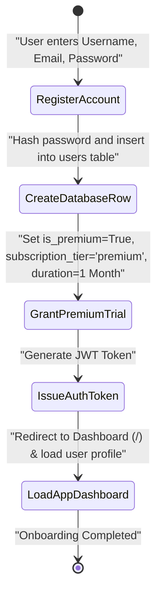
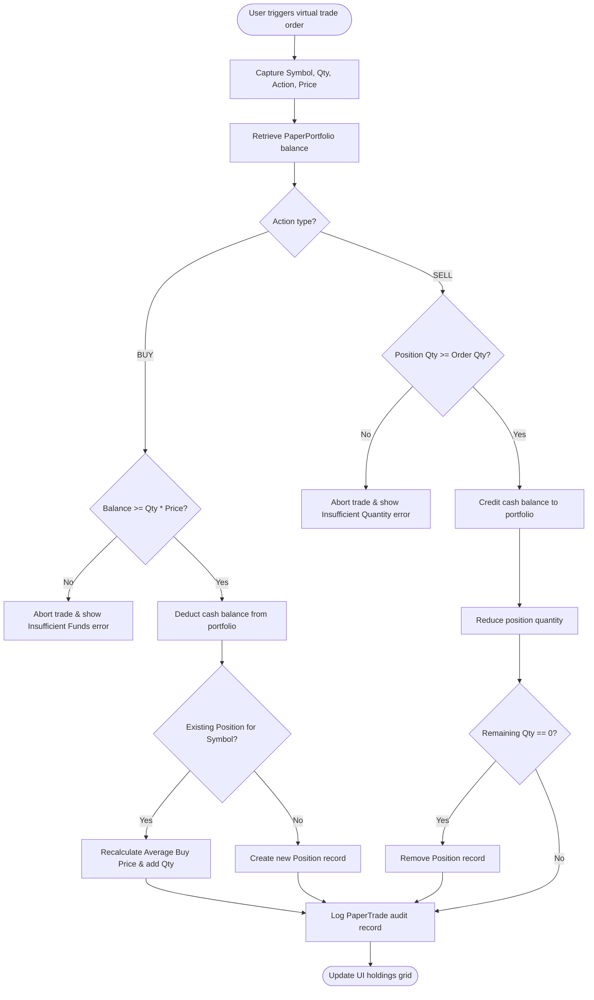
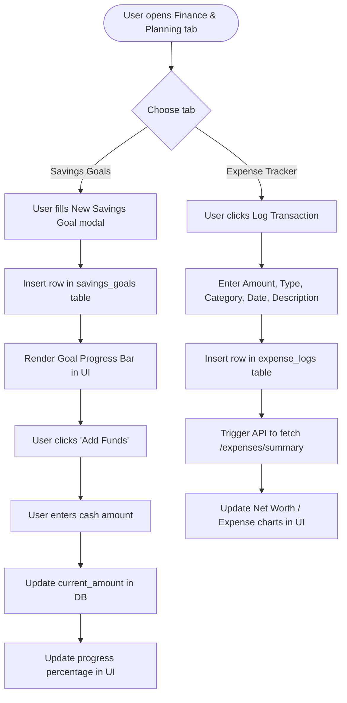

# Activity Workflows

This document visualizes the runtime workflows and activity logs of key operations within the application.

---

## 1. User Registration & Onboarding Lifecycle

Shows the flow when a new user registers an account and sets up their initial access.

---

## 2. Paper Trading Order Lifecycle

Traces the execution of a virtual order placed by a user in the Paper Trading panel.

---

## 3. Financial Goal Planner & Expense Tracker Workflow

Documents the flow of user transactions, savings goal allocation, and summary updates in the Finance subsystem.

