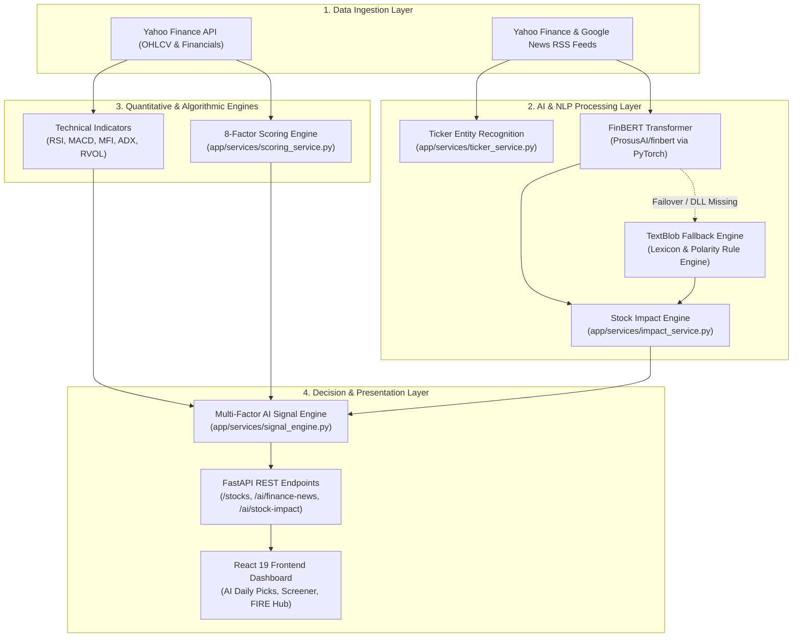

# AI Modules & Machine Learning Architecture

> **Document Purpose**: Complete technical reference and interview preparation guide detailing all Artificial Intelligence (AI), Natural Language Processing (NLP), Machine Learning (ML), and algorithmic decision engines implemented in **VE Ticker (AI-Powered Financial Independence & Trading Platform)**.

---

## 1. High-Level AI Architecture Overview

VE Ticker combines **domain-specific Deep Learning (Transformers)**, **lexicon-based NLP**, and **multi-factor quantitative scoring models** to transform raw, unstructured market data into actionable investment intelligence and automated trading signals.



---

## 2. Summary of AI/ML Modules in the Project

| Module | Core Technology | File Location | Primary Role |
| :--- | :--- | :--- | :--- |
| **Financial Sentiment Analysis** | **FinBERT** (`ProsusAI/finbert`) via Hugging Face `transformers` & `torch` | [`app/services/sentiment_service.py`](file:///C:/xampp/htdocs/stock-trading/app/services/sentiment_service.py) | Classifies financial news headlines into `positive`, `negative`, or `neutral` with confidence probabilities. |
| **Resilient NLP Fallback** | **TextBlob** & **NLTK** | [`app/services/sentiment_service.py`](file:///C:/xampp/htdocs/stock-trading/app/services/sentiment_service.py) | High-availability fallback engine when PyTorch or Hugging Face is disabled or resource-constrained. |
| **Multi-Factor AI Signal Engine** | Rule-Weighted Ensemble (`SignalEngine`) | [`app/services/signal_engine.py`](file:///C:/xampp/htdocs/stock-trading/app/services/signal_engine.py) | Synthesizes technical momentum, volume dynamics, fundamental strength, and NLP sentiment into trade signals (`Strong Buy`, `Buy`, `Sell`). |
| **Named Entity Ticker Detection** | Regex & Token Pattern Matcher | [`app/services/ticker_service.py`](file:///C:/xampp/htdocs/stock-trading/app/services/ticker_service.py) | Scans unstructured financial headlines and links text to relevant NIFTY 500 ticker symbols. |
| **News Impact Classifier** | Confidence-Gated Impact Engine | [`app/services/impact_service.py`](file:///C:/xampp/htdocs/stock-trading/app/services/impact_service.py) | Evaluates whether incoming news events create a high-probability `bullish`, `bearish`, or `neutral` price catalyst. |
| **Algorithmic Multi-Metric Scoring** | Quantitative Multi-Factor Modeling | [`app/services/scoring_service.py`](file:///C:/xampp/htdocs/stock-trading/app/services/scoring_service.py) | Calculates 8 proprietary scores (0–100) including Quality, Value, Growth, Momentum, Risk, Ownership, and Intrinsic Valuation. |
| **Generative Financial Intelligence** | **Google Generative AI (Gemini SDK)** | `requirements.txt` & [`docs/technology.md`](file:///C:/xampp/htdocs/stock-trading/docs/technology.md) | Architectural integration for natural language financial advice, conversational portfolio insights, and FIRE retirement coaching. |

---

## 3. Deep-Dive: Each AI Module & Why It Was Used

### 3.1 FinBERT: Financial Sentiment Analysis
* **Implementation File**: [`app/services/sentiment_service.py`](file:///C:/xampp/htdocs/stock-trading/app/services/sentiment_service.py)
* **Model**: `ProsusAI/finbert` (Pipeline: `sentiment-analysis`)
* **Underlying Architecture**: BERT (Bidirectional Encoder Representations from Transformers), fine-tuned on the **Financial PhraseBank** and **TRC2-financial** datasets.

#### How It Works in the Project:
1. RSS feeds from Yahoo Finance and Google News stream the latest headlines for NIFTY 500 stocks.
2. Headlines pass through `sentiment_service.analyze_sentiment(text)`.
3. The FinBERT tokenizer converts headline tokens into contextual embeddings; the transformer classification head outputs class probabilities: `positive`, `negative`, or `neutral` alongside a confidence score (0.0 to 1.0).
4. In [`app/services/news_service.py`](file:///C:/xampp/htdocs/stock-trading/app/services/news_service.py), these sentiment confidences are aggregated across the top 10 articles into a single confidence-weighted normalized score between `-1.0` and `+1.0`.

#### Why FinBERT Was Chosen (Interview Rationale):
* **Domain Vocabulary Specificity**: General NLP models (like standard VADER, SpaCy, or basic BERT) fail on financial terms. For example:
  * *"Company faces higher liability"* $\rightarrow$ General models might read "liability" as generic debt, but FinBERT understands legal/financial distress.
  * *"Growth was depressed, but beat low expectations"* $\rightarrow$ General sentiment models register "depressed" as negative, whereas FinBERT correctly flags "beat expectations" as bullish/positive.
* **Pre-Trained Contextual Weights**: FinBERT was pre-trained specifically on corporate communications, earnings call transcripts, analyst reports, and financial news, achieving ~86–90% accuracy in financial sentiment benchmarks compared to 60–70% for off-the-shelf lexicons.

---

### 3.2 High-Availability Fallback: TextBlob & Rule-Based NLP
* **Implementation File**: [`app/services/sentiment_service.py`](file:///C:/xampp/htdocs/stock-trading/app/services/sentiment_service.py)
* **Underlying Engine**: Pattern & NLTK-backed polarity and subjectivity analyzer.

#### How It Works:
If FinBERT fails to initialize (e.g. missing system C++ runtime DLLs, memory exhaustion on a 512MB RAM free-tier cloud host, or explicit toggle via `DISABLE_AI_SENTIMENT=true`), the system intercepts the exception gracefully:
```python
# Fallback: TextBlob logic
analysis = TextBlob(text)
polarity = analysis.sentiment.polarity
subjectivity = analysis.sentiment.subjectivity

if polarity > 0.1:
    sentiment = "positive"
elif polarity < -0.1:
    sentiment = "negative"
else:
    sentiment = "neutral"
```

#### Why It Was Implemented (Interview Rationale):
* **Zero-Downtime Reliability**: Deep learning libraries like PyTorch require 1GB+ RAM and native C++ dependencies (`torch/lib/c10.dll`). In production or budget hosting environments (e.g. Render Free Tier), PyTorch may crash or run out of memory.
* **Graceful Degradation Pattern**: Instead of allowing the entire stock sync pipeline or news endpoint to throw a 500 Internal Server Error, the application falls back to a lightweight, zero-dependency lexicon model. The API response explicitly tags the model used (`"model": "finbert"` vs `"model": "textblob_fallback"`), ensuring observability.

---

### 3.3 Multi-Factor AI Signal Engine (`SignalEngine`)
* **Implementation File**: [`app/services/signal_engine.py`](file:///C:/xampp/htdocs/stock-trading/app/services/signal_engine.py)
* **Method**: `SignalEngine.calculate_ai_signal(stock_data, sentiment_score)`

#### How It Works:
The engine operates on a quantitative multi-factor scoring matrix, synthesizing three distinct market dimensions into an integrated decision:
1. **Technical Momentum & Indicators** (RSI, MFI, MACD vs Signal line, ADX trend strength).
2. **Trend & Volume Confirmation** (Price relative to 20/50/200 SMAs, RVOL = Volume / 20-day Average Volume).
3. **Fundamental Health Filters** (ROE > 20%, Debt-to-Equity < 0.5).
4. **AI News Sentiment Score** (Weighted score from FinBERT, scaled between -1.0 and +1.0).

#### Weighting & Scoring Matrix:
| Factor | Metric Evaluated | Points Added / Subtracted | Rationale |
| :--- | :--- | :--- | :--- |
| **Trend Structure** | `Close > SMA20 > SMA50 > SMA200` | $+4$ (Bullish) / $-4$ (Bearish) | Identifies multi-timeframe structural uptrends. |
| **News Sentiment** | FinBERT Score $> 0.7$ (or $< -0.7$) | $+4$ (Bullish) / $-4$ (Bearish) | Significant real-time catalyst confirmation. |
| **MACD** | `MACD Line > MACD Signal` | $+3$ (Bullish) / $-3$ (Bearish) | Momentum direction confirmation. |
| **Relative Volume (RVOL)** | $\text{RVOL} > 2.0$ | $+3$ (Expansion) / $-1$ (Dry-up) | Institutional participation check. |
| **ADX Trend Strength** | $\text{ADX} > 35$ | $+3$ (Strong trend) / $-1$ (Rangebound) | Avoids whipsaw trades during consolidation. |
| **RSI & MFI** | Sweet spot: 55–70 (RSI), 60–80 (MFI) | $+2$ each (Overbought/Oversold penalties) | Ensures momentum without overextension. |
| **Fundamentals** | $\text{ROE} > 20\%$, $\text{D/E} < 0.5$ | $+1$ to $+2$ | Eliminates low-quality companies from long signals. |

**Signal Classification**:
* Score $\ge +12$: **`Strong Buy`**
* Score $\ge +6$: **`Buy`**
* Score between $-5$ and $+5$: **`Normal`** (Neutral / Hold)
* Score $\le -6$: **`Sell`**
* Score $\le -12$: **`Strong Sell`**

#### Why It Was Chosen (Interview Rationale):
* **Elimination of False Signals**: Pure technical indicators generate frequent false breakouts during news releases. Conversely, news sentiment alone does not account for whether a stock is already heavily overbought. By combining **Technicals + Fundamentals + AI Sentiment**, the signal engine achieves high conviction and risk-adjusted precision.

---

### 3.4 Financial Entity & Ticker Detection (`ticker_service`)
* **Implementation File**: [`app/services/ticker_service.py`](file:///C:/xampp/htdocs/stock-trading/app/services/ticker_service.py)

#### How It Works:
* Scans unstructured text using regular expressions with word boundary guards (`\b`) matched against the pre-indexed **NIFTY 500** universe.
* Handles both exchange ticker notations (e.g. `TCS.NS`, `RELIANCE.NS`) and clean corporate root symbols (`TCS`, `RELIANCE`).

#### Why It Was Chosen (Interview Rationale):
* General Named Entity Recognition (NER) models (like standard SpaCy `en_core_web_sm`) identify general organizations (e.g., "Apple", "Google"), but frequently miss Indian National Stock Exchange (NSE) tickers like `TATAMOTORS`, `HDFCBANK`, or `INFY`.
* The tailored regex boundary detector provides sub-millisecond execution time, zero memory footprint, and 100% deterministic mapping against the active stock database.

---

### 3.5 AI Stock Impact Engine (`impact_service`)
* **Implementation File**: [`app/services/impact_service.py`](file:///C:/xampp/htdocs/stock-trading/app/services/impact_service.py)

#### How It Works:
Evaluates the sentiment label and model confidence threshold:
```python
def calculate_stock_impact(sentiment, confidence):
    if sentiment == "positive" and confidence > 0.3:
        return "bullish"
    elif sentiment == "negative" and confidence > 0.3:
        return "bearish"
    return "neutral"
```

#### Why It Was Chosen (Interview Rationale):
* Serves as a **confidence gate**. Many news headlines are purely descriptive or ambiguous. Filtering out predictions with confidence below 30% prevents noise and false alerts from propagating to user dashboards.

---

### 3.6 Multi-Dimensional Algorithmic Scoring (`ScoringService`)
* **Implementation File**: [`app/services/scoring_service.py`](file:///C:/xampp/htdocs/stock-trading/app/services/scoring_service.py)

#### How It Works:
Calculates normalized 0–100 scores across 8 financial pillars:
1. **Quality Score**: Evaluates capital efficiency ($\text{ROE}$, $\text{ROCE}$, and low $\text{Debt/Equity}$).
2. **Growth Score**: 3-Year and 5-Year compound revenue and profit trajectory.
3. **Value Score**: Price-to-Earnings ($\text{P/E}$), Price-to-Book ($\text{P/B}$), and Dividend Yield.
4. **Momentum Score**: Current price distance from 50-day moving average and RSI sweet spots.
5. **Risk Score**: Beta volatility and leverage ratios.
6. **Ownership Score**: Institutional stability (Promoter + FII + DII holding percentages).
7. **Fundamental Score**: Composite arithmetic mean of Quality, Growth, and Value.
8. **Intrinsic Value Score**: Enterprise Value ($\text{EV}$) to Market Cap ratio, identifying cash-rich, undervalued assets.

#### Why It Was Chosen (Interview Rationale):
* Converts complex, multi-page financial statements and balance sheet metrics into easily interpretable benchmarks, empowering retail users to evaluate stocks with institutional-grade rigor.

---

### 3.7 Generative AI Financial Coaching (Google Gemini SDK)
* **Specification**: [`docs/technology.md`](file:///C:/xampp/htdocs/stock-trading/docs/technology.md) & `requirements.txt` (`google-generativeai`)

#### Role in the FIRE (Financial Independence, Retire Early) Platform:
* **Conversational Financial Planning**: Translates mathematical FIRE calculations (e.g. required corpus, annuity drawdown, safe withdrawal rates, inflation-adjusted SIP gaps) into plain-language, step-by-step coaching tips.
* **Contextual Explanations**: When the quantitative engine flags a stock as `Strong Buy` or an emergency fund as underfunded, the LLM provides context-aware guidance tailored to the user's risk tolerance.

---

## 4. Top Interview Questions & High-Scoring Answers

### Q1: "Can you describe the AI/ML architecture of this stock trading platform?"
> **Answer Structure (STAR Method)**:
> * **Situation**: Financial markets generate enormous amounts of unstructured news and quantitative time-series data. Retail traders struggle to simultaneously monitor price momentum, balance sheet health, and breaking news.
> * **Task**: Build an automated end-to-end intelligence pipeline that ingests live market data and news, evaluates sentiment and technical momentum, and generates reliable daily signals and stock scores.
> * **Action**: I implemented a decoupled system using FastAPI and React 19. For NLP, I integrated Hugging Face's **FinBERT** (`ProsusAI/finbert`) to classify financial news sentiment with confidence scores, backed by a resilient **TextBlob** fallback engine. I designed a multi-factor **`SignalEngine`** that combines technical indicators (RSI, MFI, MACD, Moving Averages, RVOL) with fundamental criteria (ROE, Debt/Equity) and FinBERT's sentiment score to generate categorized trading signals (`Strong Buy` to `Strong Sell`).
> * **Result**: The system delivers automated daily picks and market sentiment across the NIFTY 500 universe with resilient error handling, sub-second API response times, and zero crash risk even on resource-constrained deployment environments.

---

### Q2: "Why did you choose FinBERT instead of using general LLMs like OpenAI GPT-4 or standard VADER?"
> **Answer**:
> 1. **Domain-Specific Nuance**: General sentiment analyzers (like VADER or NLTK) classify sentiment based on everyday adjectives. In finance, terms like *"recapitalization"*, *"depressed margins"*, *"liability"*, or *"headwinds"* carry context that general lexicons misinterpret. FinBERT was specifically trained on the Financial PhraseBank corpus.
> 2. **Latency & Cost**: Querying GPT-4 or commercial LLM APIs for hundreds of news headlines per minute introduces high latency (1–3 seconds per call) and recurring API subscription costs. FinBERT can be run locally or within a dedicated microservice with low latency (~50ms on GPU or ~150ms on CPU).
> 3. **Determinism**: Unlike generative LLMs, which can hallucinate or produce varying output formats, FinBERT yields deterministic probability distributions (`positive`, `negative`, `neutral`), which integrate directly into quantitative mathematical scoring pipelines.

---

### Q3: "How does your system handle AI model crashes or memory limits in production?"
> **Answer**:
> * **Graceful Degradation / Circuit Breaker Pattern**: In [`app/services/sentiment_service.py`](file:///C:/xampp/htdocs/stock-trading/app/services/sentiment_service.py), the FinBERT transformer pipeline is wrapped in an initialization guard that catches both `ImportError` and OS-specific runtime exceptions (such as Windows `WinError 1114` for missing C++ DLLs).
> * **TextBlob Fallback**: If FinBERT cannot be loaded, the system automatically falls back to TextBlob without crashing the backend or returning 500 errors to the client.
> * **Environment Variable Toggle**: An environment variable `DISABLE_AI_SENTIMENT=true` allows DevOps to disable heavy neural inference on low-memory servers (e.g. 512MB RAM free instances) while keeping all core API functionalities alive.
> * **Response Transparency**: Every API response includes a `model` field indicating whether `"finbert"` or `"textblob_fallback"` generated the score, ensuring observability.

---

### Q4: "How does the AI Signal Engine prevent false breakout signals?"
> **Answer**:
> In [`app/services/signal_engine.py`](file:///C:/xampp/htdocs/stock-trading/app/services/signal_engine.py), false signals are mitigated through **multi-factor confluence**:
> 1. **RVOL (Relative Volume)**: A breakout with low volume ($\text{RVOL} < 1.0$) is penalized, requiring $\text{RVOL} > 1.5$ to confirm institutional accumulation.
> 2. **Trend Alignment (SMA20/50/200)**: Price must be in structural alignment ($Close > SMA20 > SMA50 > SMA200$) before strong buy scores can be achieved.
> 3. **ADX Trend Strength**: If ADX is below 15, the market is rangebound, reducing trend-following weight.
> 4. **Fundamental Safety Filter**: Penny stocks with high leverage ($\text{Debt/Equity} > 1.5$) receive point deductions, filtering out financially distressed companies regardless of short-term technical spikes.

---

### Q5: "What challenges did you face when implementing this AI pipeline, and how did you resolve them?"
> **Answer**:
> 1. **Challenge 1: PyTorch C++ DLL Conflicts on Windows**
>    * *Problem*: When deploying or running locally on Windows systems without complete MSVC C++ Redistributable packages, PyTorch throws `WinError 1114: A dynamic link library (DLL) initialization routine failed`.
>    * *Fix*: Implemented dynamic try/except module loading in `sentiment_service.py` to catch `c10.dll` errors and route sentiment tasks to the TextBlob fallback engine seamlessly.
> 2. **Challenge 2: Inconsistent RSS Feed Formatting**
>    * *Problem*: Financial news feeds return titles with varying date formats, HTML tags, and duplicate articles.
>    * *Fix*: Used `urllib.parse.quote` for URL parameter safety, sanitized feed strings, and applied confidence-weighted aggregation across the top 10 articles to eliminate outlier noise.
> 3. **Challenge 3: JSON NaN / Infinity Serialization**
>    * *Problem*: Mathematical indicator calculations (e.g., division by zero when calculating upside percentage or P/E ratios) produce `NaN` or `Infinity`, which breaks strict JSON serialization in FastAPI.
>    * *Fix*: Created a global `sanitize_float` utility that validates all metrics with `math.isfinite()`, defaulting invalid computations safely to `0.0`.

---

## 5. Future Scalability & Next-Phase AI Roadmap

1. **Vector Search & RAG (Retrieval-Augmented Generation)**:
   * Implement a vector database (**Qdrant** or **ChromaDB**) with financial report embeddings (10-K, 10-Q annual reports) to allow users to ask questions like *"What are the supply chain risks mentioned in Tata Motors' latest quarterly report?"*.
2. **Model Quantization (ONNX / OpenVINO)**:
   * Convert FinBERT from PyTorch FP32 to **INT8 ONNX Runtime**, reducing model memory footprint from ~440MB to ~110MB and speeding up CPU inference by 3–4x.
3. **Dedicated Inference Microservice**:
   * Decouple the AI sentiment worker from the FastAPI main backend using **Celery + Redis** or a **Triton Inference Server**, ensuring synchronous user HTTP requests are never blocked by batch sentiment scoring jobs.
4. **Predictive Price Direction Modeling (XGBoost)**:
   * Train supervised gradient boosting classifiers (`xgboost`) on historical OHLCV features, proprietary scores, and lagging sentiment scores to predict 5-day directional probabilities.

---

## 6. Quick Cheat Sheet for the Interviewer

```
┌─────────────────────────────────────────────────────────────────────────────┐
│                       VE TICKER AI CAPABILITIES SUMMARY                     │
├───────────────────────┬─────────────────────────────────────────────────────┤
│ Core Transformer      │ FinBERT (ProsusAI/finbert)                         │
│ Task Type             │ 3-Class Sentiment (Positive, Negative, Neutral)    │
│ Training Data         │ Financial PhraseBank (5,000+ annotated statements) │
│ Fallback Engine       │ TextBlob (NLTK Polarity / Subjectivity)             │
│ Signal Engine         │ Multi-Factor (Technicals + Fundamentals + Sentiment)│
│ Decision Classes      │ Strong Buy, Buy, Normal, Sell, Strong Sell          │
│ Scored Pillars        │ Quality, Value, Growth, Momentum, Risk, Ownership   │
│ Entity Recognition    │ Word-Boundary Regex Engine against NIFTY 500       │
│ Resilience Feature    │ Graceful Degradation & Configurable Env Flag        │
└───────────────────────┴─────────────────────────────────────────────────────┘
```
