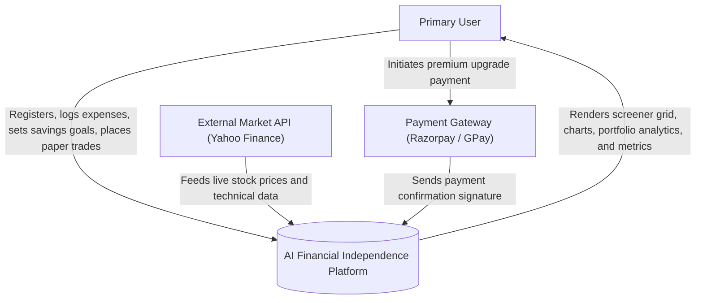
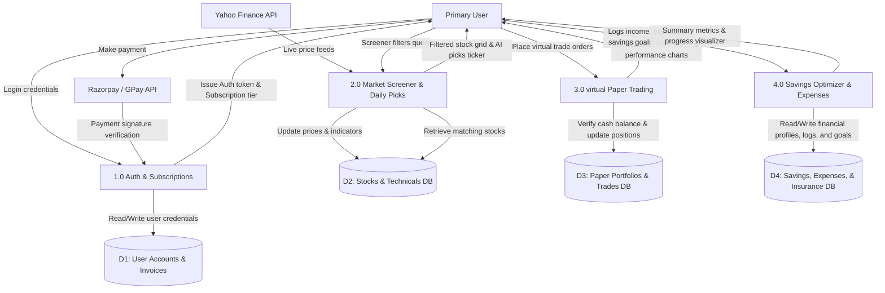

# Data Flow Diagram (DFD)

This document maps the flow of data within the application system, illustrating the boundaries, processes, data stores, and data movements.

---

## Level 0: Context Diagram

The Level 0 diagram shows the core application system and its interactions with external entities.

---

## Level 1: Key Subsystems Data Flow

The Level 1 diagram breaks the system into core processing modules and databases.

---

## Data Flow Descriptions

### 1. User Authentication & Subscription Gates (1.0)
*   **Input**: User submits email/password to login, or completes payment verification via external gateway.
*   **Flow**: Process queries **D1 (User Accounts)** to verify credentials and check subscription expiration timestamps. On payment success, updates user tier in database.
*   **Output**: Issues a JWT token indicating user tier (Free, Pro, Premium) to the client web browser.

### 2. Market Data Screening (2.0)
*   **Input**: Background APScheduler triggers request live feeds from **Yahoo Finance API**.
*   **Flow**: Process writes raw price points, indicators (RSI, MFI, SMA, EMA, MACD, 52W Range) into **D2 (Stocks DB)**. When a user queries custom screener formulas, the process queries **D2** and applies filter parameters.
*   **Output**: Renders filtered tables, tickers, and triggers user alerts.

### 3. virtual Paper Trading (3.0)
*   **Input**: User places a paper trade order.
*   **Flow**: Process reads current balance from **D3 (Trades DB)** to check affordability, registers transaction log, and computes average buy price and open position quantities.
*   **Output**: Renders real-time holdings and overall P&L charts.

### 4. Savings Optimizer & Financial Tracker (4.0)
*   **Input**: User inputs active savings milestones, monthly income/expense transactions, or insurance policy details.
*   **Flow**: Process writes records to **D4 (Savings, Expenses, & Insurance DB)**, updating the balance sheets.
*   **Output**: Renders progress visualizers, remaining budget balances, and premium renewal reminders in the UI dashboard.
