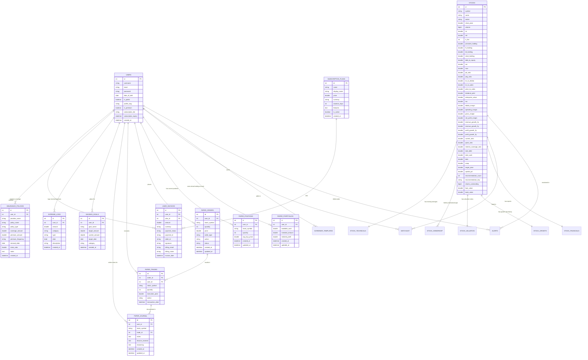

# Entity Relationship Diagram (ERD)

This document visualizes the complete database schema for the application, representing entities, properties, primary/foreign keys, and structural relationships.

---

## Core Schema Visualization

---

## Schema Entities & Descriptions

### 1. User & Access Control
*   **`users` Table**: The parent table representing active accounts. Tracks credentials, profile visibility, and subscription status.
*   **`subscription_plans` / `user_invoices` Tables**: Catalog of available subscription tiers and log of user checkout transactions.

### 2. Market Screener & Stock Insights
*   **`stocks` Table**: Primary data store for market equities, holding price points, sectors, ownership distributions, and key oscillators (RSI, MFI).
*   **`stock_details` Tables**: Dimensional tables (`StockFinancials`, `StockGrowth`, `StockValuation`, `StockOwnership`, `StockTechnicals`) storing deep financial ratios.
*   **`screener_templates` Table**: User-defined custom filters.
*   **`alerts` / `watchlist` Tables**: Monitored symbols and price triggers.

### 3. virtual Paper Trading
*   **`paper_portfolios` Table**: Tracks sandbox account balances.
*   **`paper_positions` Table**: Logs open equity holdings.
*   **`paper_orders` / `paper_trades` Tables**: Audit trail of simulated transaction executions.
*   **`paper_journal` Table**: User notes summarizing trade reasons and lessons.

### 4. Savings Optimizer & Expenses
*   **`savings_goals` Table**: Active financial goals (e.g. Emergency Fund).
*   **`expense_logs` Table**: Flow of transaction records (incomes/expenses).
*   **`insurance_policies` Table**: Medical, term, and vehicle protection policy registry.
