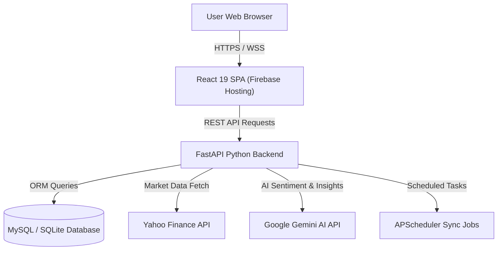

# Technology Stack & Deployment Guide

Welcome to the official technical documentation for **VE Ticker (AI-Powered Financial Independence Platform)**. This document outlines the system architecture, full technology stack specifications, low-cost/free hosting options for the Python REST API, and step-by-step instructions for deploying the React frontend application to **Firebase Hosting** under `veticker.web.app`.

---

## 1. System Architecture & Overview

The platform is designed as a modern decoupled web application:
- **Frontend**: Single Page Application (SPA) built with React 19, TypeScript, Vite, and Tailwind CSS.
- **Backend REST API**: High-performance asynchronous API built with Python FastAPI, Uvicorn, and SQLAlchemy.
- **Database**: Relational Database Management System (MySQL / SQLite) storing users, stock indicators, daily picks, portfolios, and FIRE retirement plans.
- **External Data Engines**: Yahoo Finance (`yfinance`) API, Google Generative AI (Gemini SDK), and technical analysis data pipelines.



---

## 2. Technology Stack Specifications

### 2.1 Frontend Stack
| Component | Technology | Version / Details |
| :--- | :--- | :--- |
| **Framework** | React | 19.x (Functional components, custom hooks) |
| **Language** | TypeScript | ~6.0 (Strict type definitions) |
| **Build Tooling** | Vite | 8.x (Fast HMR & Optimized production bundles) |
| **Styling** | Tailwind CSS | 3.4.x (Utility-first, responsive dark/light glassmorphic UI) |
| **Icons** | Lucide React | Modern minimalist vector icon sets |
| **Charting** | Recharts | Interactive financial, technical, and net worth charts |
| **HTTP Client** | Axios | Interceptors for JWT auth & error handling |
| **Data Fetching** | TanStack Query | Query caching, optimistic UI updates |
| **Routing** | React Router DOM | 7.x (Client-side routing) |

### 2.2 Backend Stack
| Component | Technology | Details |
| :--- | :--- | :--- |
| **Language** | Python | 3.11+ |
| **Framework** | FastAPI | Asynchronous RESTful API framework |
| **ASGI Server** | Uvicorn | Production-grade ASGI server |
| **Database ORM** | SQLAlchemy | Relational mapping & session management |
| **Database Driver** | PyMySQL / SQLite | MySQL connector for production, SQLite for dev/testing |
| **Scheduler** | APScheduler | Background jobs for automated stock data updates |
| **Security** | PyJWT / Passlib / Bcrypt | JWT authentication token generation and password hashing |
| **AI Models** | Google Generative AI | Gemini API integration for financial coaching & insights |
| **ML & Data Processing**| XGBoost / NLTK / TextBlob | Financial sentiment analysis and predictive scoring |

---

## 3. Low-Cost & Free Python REST API Hosting Providers

To run the Python FastAPI backend in development, staging, or production for **free or at a very minimal cost**, several cloud platforms offer generous free tiers and instant live HTTPS endpoints.

### 3.1 Platform Comparison Matrix

| Provider | Free Tier / Cost | Database Included | Public HTTPS URL | Recommended For |
| :--- | :--- | :--- | :--- | :--- |
| **Render.com** | **100% Free** (Web Service free tier) | PostgreSQL (Free 90 days) | `https://<app>.onrender.com` | **Recommended** (Easy setup, free SSL) |
| **Koyeb** | **Free Nano Tier** ($0/month) | External DB | `https://<app>.koyeb.app` | High performance, Docker native |
| **Hugging Face Spaces**| **100% Free** (CPU Basic, 16GB RAM) | External DB / SQLite | `https://<user>-<space>.hf.space` | Free Docker / FastAPI hosting |
| **Railway.app** | $5/month trial credits | MySQL & Postgres | `https://<app>.up.railway.app` | Full stack + DB hosting |
| **PythonAnywhere** | **Free Beginner Plan** | SQLite / MySQL | `https://<user>.pythonanywhere.com` | Standard WSGI Python hosting |
| **Google Cloud Run** | 2 Million Requests / Month Free | Cloud SQL / External DB | `https://<app>.a.run.app` | Serverless scalable containers |

---

### 3.2 Step-by-Step Backend Deployment Instructions

#### Option 1: Render.com (Recommended for Free Development API URL)
1. **Prepare Repository**: Push your code (including `requirements.txt` and `app/main.py`) to GitHub or GitLab.
2. **Create Web Service**:
   - Log in to [Render Dashboard](https://render.com).
   - Click **New +** -> **Web Service**.
   - Connect your Git repository.
3. **Configure Settings**:
   - **Environment**: `Python 3`
   - **Build Command**: `pip install -r requirements.txt`
   - **Start Command**: `uvicorn app.main:app --host 0.0.0.0 --port $PORT`
   - **Instance Type**: Select **Free** (512 MB RAM, 0.1 CPU).
4. **Environment Variables**: Add key `SECRET_KEY` and any database credentials (`DB_HOST`, `DB_USER`, `DB_PASS`, `DB_NAME`).
5. **Get Live URL**: Click **Create Web Service**. Once built, Render will assign your backend a live HTTPS REST API URL (e.g., `https://veticker-api.onrender.com`).

#### Option 2: Koyeb Deployment
1. Log in to [Koyeb Console](https://www.koyeb.com).
2. Click **Create App** and choose **GitHub** deployment or **Docker** deployment.
3. Select your repository, set builder to `Dockerfile` or Python runtime.
4. Set port to `8000` and start command `uvicorn app.main:app --host 0.0.0.0 --port 8000`.
5. Deploy to receive your live endpoint: `https://veticker-backend.koyeb.app`.

#### Option 3: Hugging Face Spaces (Docker FastAPI)
1. Create a new Space on [Hugging Face](https://huggingface.co/spaces) with SDK set to **Docker**.
2. Upload the repository code containing the existing `Dockerfile`.
3. Hugging Face will automatically build the container and provide a live public HTTPS endpoint: `https://<username>-veticker-api.hf.space`.

---

## 4. Connecting the React Frontend to the Live REST API

To configure the frontend to communicate with the live Python REST API:

1. **Update `.env` in `frontend/` directory**:
   ```env
   VITE_API_URL=https://veticker-api.onrender.com/
   ```
   *(Replace with your actual deployed Python REST API live endpoint).*

2. **Verify API Client Configuration**:
   The API client in [`frontend/src/services/api.ts`](file:///C:/xampp/htdocs/stock-trading/frontend/src/services/api.ts) automatically resolves the environment variable:
   ```typescript
   const API_BASE_URL = import.meta.env.VITE_API_URL || 'http://localhost:8000/';
   ```

3. **Configure Backend CORS Settings**:
   Ensure `app/main.py` permits requests from `https://veticker.web.app`:
   ```python
   app.add_middleware(
       CORSMiddleware,
       allow_origins=["https://veticker.web.app", "http://localhost:5173", "*"],
       allow_credentials=True,
       allow_methods=["*"],
       allow_headers=["*"],
   )
   ```

---

## 5. Firebase Hosting Deployment Guide (`veticker.web.app`)

### 5.1 Project & Hosting Configuration

The root directory contains the Firebase project configuration files:

- **`.firebaserc`**:
  ```json
  {
    "projects": {
      "default": "chaubeyedu"
    }
  }
  ```

- **`firebase.json`**:
  ```json
  {
    "hosting": {
      "site": "veticker",
      "public": "frontend/dist",
      "ignore": [
        "firebase.json",
        "**/.*",
        "**/node_modules/**"
      ],
      "rewrites": [
        {
          "source": "**",
          "destination": "/index.html"
        }
      ]
    }
  }
  ```

---

### 5.2 Build and Upload Steps

Execute the following commands from your project root:

1. **Build the Production Bundle**:
   ```bash
   cd frontend
   npm run build
   ```
   *This compiles TypeScript code and bundles React assets into `frontend/dist/` with the live REST API URL baked in.*

2. **Deploy to Firebase Hosting**:
   ```bash
   firebase deploy --only hosting
   ```

3. **Access the Live Production Application**:
   - **Production Site URL**: [https://veticker.web.app](https://veticker.web.app)
   - **Alternative Firebase Subdomain**: [https://chaubeyedu.web.app](https://chaubeyedu.web.app)

---

## 6. Summary Workflow

```
[ Local Development ]
  ├── FastAPI (http://localhost:8000)
  └── Vite React (http://localhost:5173)

        │
        ├── 1. Deploy FastAPI backend to Render / Koyeb / Hugging Face
        │      └── Live REST API URL: https://veticker-api.onrender.com/
        │
        ├── 2. Update frontend/.env (VITE_API_URL=https://veticker-api.onrender.com/)
        │
        ├── 3. Rebuild frontend: `npm run build`
        │      └── Output generated in `frontend/dist/`
        │
        └── 4. Deploy to Firebase Hosting: `firebase deploy --only hosting`
               └── Live Web App: https://veticker.web.app
```
