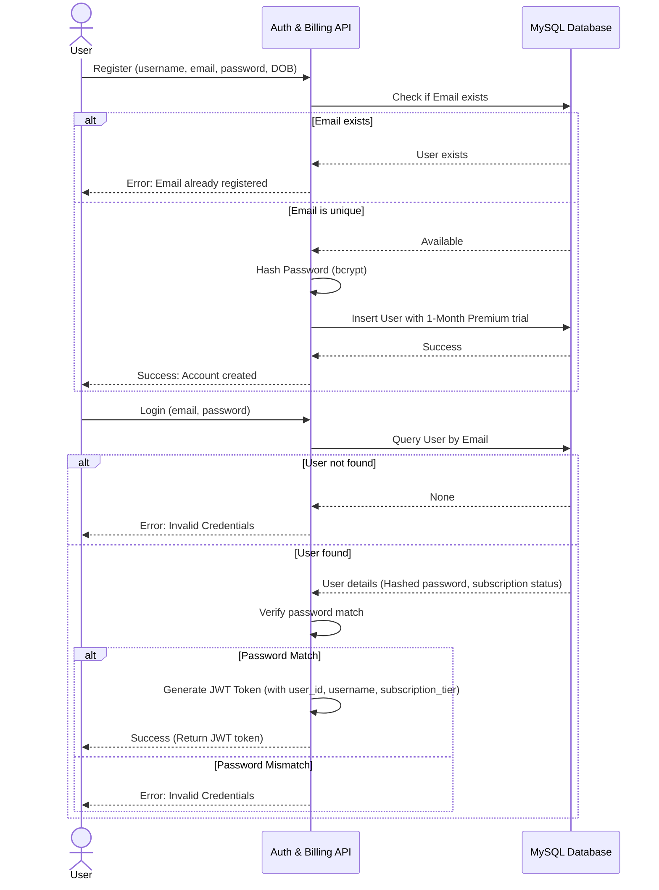
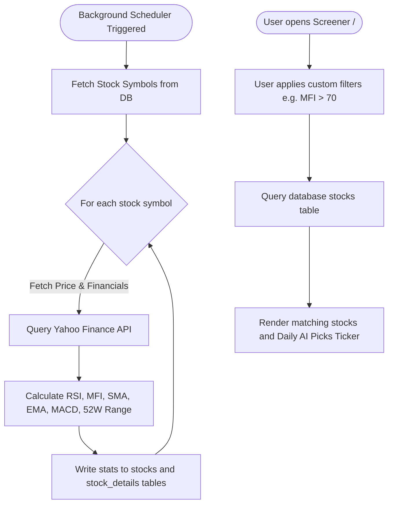
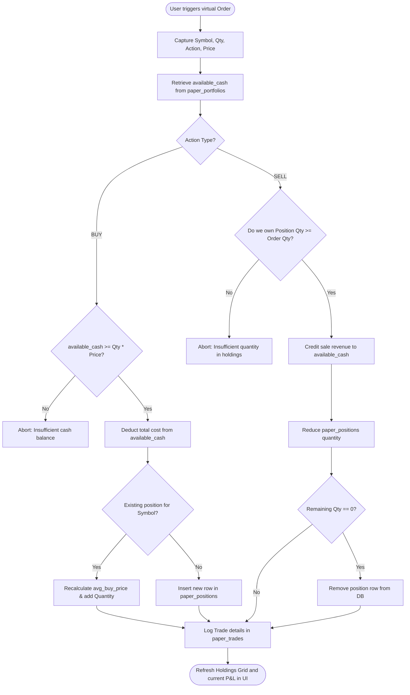

# Project Activity Diagrams

This document outlines the core operational workflows of the AI-Powered Financial Independence (FIRE) Platform using standard Mermaid diagrams.

---

## 1. User Registration & Login Workflow

This diagram illustrates the sequence of actions when a user registers a new account and subsequently logs in.

---

## 2. Stock Scanner & Indicators Workflow

This flow illustrates how background schedulers fetch stock data and how users query the Screener.

---

## 3. Paper Trading Order Execution Workflow

This diagram traces the execution and balance checks for virtual transactions.

